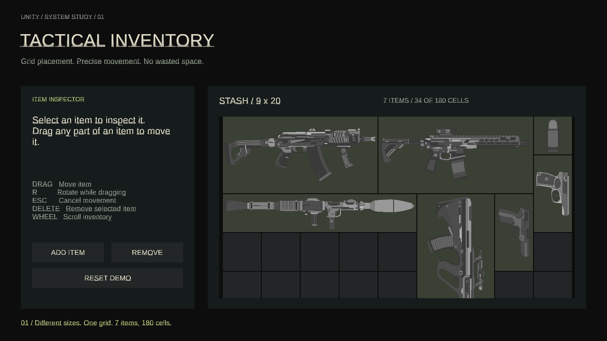
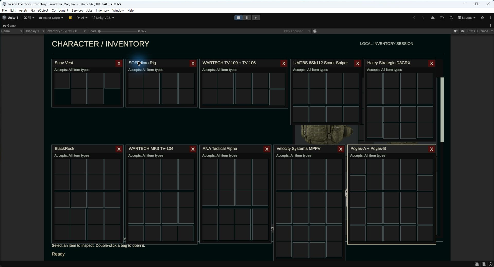

# Tactical Inventory

Escape from Tarkov에서 영감을 받은 Unity 인벤토리 포트폴리오입니다. 아이템 이동·회전, 가방 중첩, 유형별 수납 정책, 떨어진 구획과 스택을 하나의 안전한 변경 경로로 처리합니다.



## 실행

- Unity `6000.6.4f1`에서 `Assets/Scenes/Inventory.unity`를 열고 Play를 누릅니다.
- Windows: `Build/TacticalInventory.exe`. 실행 파일과 `_Data`, Unity DLL 파일을 함께 유지합니다.
- 로컬 배포 묶음: `Builds/TacticalInventory-Windows.zip`을 풀고 실행합니다. 빌드 산출물은 Git에서 제외됩니다.
- 생성 메뉴: `Inventory > Build Windows Demo`.
- [13.5초 실제 Game View 영상](docs/inventory-walkthrough.mp4) · [검증 결과](docs/validation.md) · [계획](PLAN.md) · [전체 흐름](docs/inventory-flow.html).
- [29.8초 Inspector 편집 → Play → 수납 시연](docs/inventory-inspector-walkthrough.mp4): 실제 Unity Inspector 입력·즉시 미리보기·포켓 추가/Undo와 현재 프로젝트의 빠른 Game View 시연을 연결했습니다.
- [30.8초 다양한 수납·거절 시연](docs/inventory-container-showcase.mp4): 원래 동작 속도를 유지하며 대기를 줄이고, 8개 기능별 제목과 수납 성공·거절 결과를 표시합니다. 리그 수납, 내용물이 든 리그의 이동, 가방 → 가방 → 리그 중첩과 크기·공간·유형·순환 중첩 거절을 보여줍니다.

## 조작

| 입력 | 동작 |
|---|---|
| 좌클릭 / 드래그 | 선택·정보 확인 / 잡은 칸을 유지하며 이동 |
| 드래그 중 R | 미리보기 회전 |
| Esc | 드래그·분할·메뉴 취소; 대기 중 가장 앞 창 닫기 |
| 가방 더블클릭 / OPEN | 독립 창 열기; 같은 가방은 기존 창 앞으로 |
| 창 제목 드래그 / X | 창 이동·맨 앞으로 표시 / 해당 창 닫기 |
| 가방 창 격자 / 가방 아이템 위 드롭 | 지정 칸 배치 / 허용된 내부 빈 칸 자동 수납 |
| 우클릭 | 열기·분할·삭제 메뉴 |
| SPLIT | 수량 입력 → 확인 → 빈 칸 클릭으로 확정 |
| 같은 탄약 위 드롭 | 최대 스택까지 합치고 잔량은 원래 칸 유지 |
| Delete / DELETE | 선택 아이템 삭제; 내용물이 있는 가방은 거절 |
| 휠 / 스크롤바 | 각 패널 스크롤 |
| RESET | 리그 10종을 포함한 초기 22개 인스턴스로 복원 |

초록 미리보기는 배치 가능, 빨강은 불가이며 실패 이유를 함께 표시합니다. 구획 경계·빈 여백·뷰포트 밖 드롭, 가방의 자기/자손 수납은 거절됩니다. 클릭 중에만 흰 원이 보입니다.

창 위치·앞뒤 순서는 UI만 소유하며 아이템 배치와 분리됩니다. 가방을 다른 가방으로 옮겨도 열린 창과 내용물 ID가 유지됩니다. 얇은 회색 테두리·짧은 제목 막대·빨간 닫기 버튼·오른쪽 보관함은 [타르코프 다중 창 참고 화면](https://forums.d2jsp.org/topic.php?f=208&t=78030958)의 구성을 적용했습니다.

시작 상태는 보관함의 두 Berkut, 전용 케이스와 리그, 무기·탄약·부품입니다. 첫 Berkut 안의 MBSS 안에 AI-2가 있습니다. 같은 가방 정의를 사용하는 두 인스턴스의 내용은 독립적입니다.

Scav Vest, SOE Micro, WARTECH TV-109 + TV-106, Scout-Sniper, D3CRX, BlackRock, MK3, Alpha, MPPV, Poyas-A + B의 실제 포켓 배치를 구현했습니다. BlackRock은 위쪽에, 나머지 9종은 보관함 아래쪽 20행부터 있습니다. [리그별 칸 수·원본·편집 안내](docs/rig-presets.md).



Play에서 `Inventory > Show All Rig Windows (Play Mode)`를 실행하면 위 화면처럼 10종을 비교할 수 있습니다. 각각 실제 드래그·수납이 가능한 창입니다.

## 데이터 편집

원본은 `Assets/Items/Expansion/`의 ScriptableObject(SO)입니다. 실행 시작 시 검증된 불변 정의로 복사합니다. SO 변경은 다음 Play에서 반영되며 RESET은 현재 정의로 인스턴스만 다시 만듭니다.

1. `Inventory > Catalog Table`에서 아이템 ID·이름·분류·가로·세로·최대 스택·컨테이너·아이콘을 편집합니다.
2. `Inspect` 또는 Project의 `item-*.asset`을 선택하면 커스텀 Inspector에서 외부 크기·스택·연결된 컨테이너를 편집합니다. 포켓 미리보기를 클릭하고 크기·X/Y·수납 규칙을 변경하거나 포켓을 추가·삭제합니다. 변경은 SO에 직접 반영되고 Undo/Redo를 지원합니다.
3. 허용/금지 분류는 자손까지 적용됩니다. 개별 아이템 예외도 설정할 수 있으며 금지 조건이 우선합니다. 공통 정책과 구획 정책을 모두 만족해야 합니다.
4. `ContainerLayoutDefinition`에서 구획 ID별 표시 위치를 설정합니다. 레이아웃은 배치 규칙과 분리되며 겹침·누락·잘못된 좌표를 검증합니다.
5. 표의 저장·검증을 실행하고 Play를 다시 시작합니다. 중복 ID·분류 순환·누락 참조·잘못된 크기/스택/이미지로는 시작할 수 없습니다.

| 샘플 | 외부 크기 | 내부 / 수납 | 최대 스택 |
|---|---|---|---|
| MBSS / Berkut | 4×4 / 4×5 | 4×4 / 4×5, 전체 허용 | 1 |
| Ammunition case | 2×2 | 7×7, Ammo 하위 유형 | 1 |
| Medicine case | 3×3 | 7×7, Medical 하위 유형 | 1 |
| Pst gzh / PS gs | 1×1 | 탄약 | 50 / 60 |
| AI-2 / RK-0 | 1×1 | 의료품 / 무기 부품 | 1 |
| AKS-74U | 4×2 | 무기 | 1 |
| BlackRock | 3×4 | 11개 독립 포켓, 20칸 | 1 |
| 실재 리그 10종 | 2×3 ~ 4×4 | 3 ~ 19개 독립 포켓, 6 ~ 25칸 | 1 |

리그 10종의 외부 크기·포켓 배치는 [고정 원본 데이터 및 위키 이미지](docs/rig-presets.md)와 대조했습니다. 포켓 간격은 이 프로젝트의 UI 피치에 맞췄습니다. 나머지 아이템의 크기·수납·스택은 포트폴리오용 설정값입니다.

리그 편집에는 JSON 수정이나 별도 생성 작업이 필요하지 않습니다. 커스텀 Inspector의 미리보기는 즉시 갱신되며 다음 Play부터 변경된 SO를 사용합니다. 포켓 X/Y는 표시 셀 단위이고 왼쪽 위가 원점입니다. 겹침·누락은 Inspector에서 표시합니다. `Assets/Items/Expansion/RigPresets.json`은 샘플 초기값이며 `Inventory > Samples > Restore Catalog Defaults...`는 확인 후 모든 샘플 SO 편집값을 초기값으로 덮어씁니다.

## 구조와 설계

| 어셈블리 / 경로 | 책임 |
|---|---|
| `Catalog` | SO 원본, 불변 정의·카탈로그, 분류·정책·레이아웃 검증 |
| `Domain` | 인스턴스·배치·점유 스냅샷, 순수 규칙, 이동·자동 수납·스택·편집·초기화 서비스 |
| `Presentation` | 입력 이벤트, 좌표 판별, 드래그 임시 상태, 패널·창·정보 Presenter와 화면 Factory |
| `Runtime` | `ExpandedInventory` 구성 루트, 초기 데이터와 시연 시나리오 |
| `Editor` | SO 편집·표, 씬·Windows 빌드, 프레임 녹화 |

SRP에 따라 생성·검증·확정·알림·입력·표시를 별도 타입으로 분리합니다. 입력은 `IInventoryReadModel`과 이동·자동 수납·스택·편집 서비스만 사용하고, 가변 상태와 확정 API는 Domain 내부에 제한됩니다. Presentation은 Runtime을 참조하지 않습니다.

- Factory: 아이템/뷰 생성. MVP: 입력·표시와 모델 분리. Composition Root: 의존성 조립. Observer: 확정 완료 알림.
- 정의·인스턴스·컨테이너·구획 ID를 구분하고, 소속·좌표·회전은 배치가 단독 소유합니다. 가방 이동은 내부 ID와 내용물을 유지합니다.
- 변경은 다음 상태 전체를 준비·검증한 뒤 한 번 교체합니다. 실패·취소 시 원본은 유지됩니다. 콜백 예외를 격리하고 확정/알림 중 재진입을 거절합니다.
- 초기화는 같은 세션과 구독을 유지하며 전체 트리만 교체합니다. 종료 시 구독을 해제합니다.
- 미리보기는 확정 스냅샷별 캐시와 오버레이를 사용합니다. 포인터 이동마다 전체 아이템 목록을 다시 만들지 않습니다.
- 분류별 상속 계층, 전역 가변 저장소, 전역 이벤트 버스, 모든 규칙의 인터페이스화는 사용하지 않습니다.

## 검증과 시연 재생성

Unity Test Runner의 `InventorySystem.Tests`(Edit Mode 61개), `InventorySystem.PlayModeTests`(Play Mode 15개)를 실행합니다. Windows 실행 파일의 `-inventory-smoke-test` 옵션은 실제 플레이어에서 27단계 Unity 입력 이벤트 시나리오를 검증하고 종료합니다.

1. Play에서 `Inventory > Set Capture Resolution 1280x720`을 선택합니다.
2. `Inventory > Record Walkthrough (Play Mode)`를 실행합니다.
3. `TestResults/recording.txt`가 `1215 frames / 30 fps / 40.5 seconds`로 갱신되면 캡처가 완료됩니다.
4. 프로젝트 루트에서 `uv run --with imageio-ffmpeg python scripts/encode_walkthrough.py`를 실행합니다. 기본 3배 재생으로 405프레임·13.5초를 생성합니다. `--speed 1`은 원래 속도입니다.

영상은 실행 중인 Game View 캡처입니다. 이동은 실제 Unity 포인터 핸들러를, 회전·취소는 키보드 입력과 공유하는 명령을 사용합니다. 물리 마우스·키보드 수동 시연은 아닙니다. 클릭 위치 원은 누르는 동안만 표시되며 캡처 단계는 1.5초, 이동은 0.48초 감속 이징이며 완성 영상은 3배 재생으로 단계 0.5초·이동 0.16초입니다. 사용자 드래그는 포인터를 즉시 따라갑니다. 녹화는 PC 성능에 따라 40.5초보다 오래 걸릴 수 있습니다.

다양한 수납 시연은 Play에서 `Inventory > Record Container Showcase (Play Mode)`를 실행합니다. `TestResults/container-showcase.txt`에 `1764 frames`와 `49 verified stages`가 기록되면 완료입니다. 다음 명령은 동작 사이의 대기만 잘라내고 기능별 제목과 동작·결과 설명을 추가합니다. 제목은 여러 동작 동안 유지되며 별도 상단 영역에 배치해 실제 UI와 아래쪽 거절 사유를 가리지 않습니다.

```powershell
uv run --with imageio-ffmpeg python scripts/edit_container_showcase.py
```

원본은 단계 1.2초·드래그 0.42초 감속 이징입니다. 편집본은 1배속과 드래그 프레임을 유지하면서 대기 28초만 제거해 924프레임·30fps·30.8초입니다. 실제 1280×720 Game View를 제목 영역과 함께 1920×1080 영상으로 구성합니다. 편집에 사용한 원본 프레임 번호와 자막 구간은 `Recordings/container-showcase-edit/<실행 ID>/edit.json`에 남습니다. 녹화 입력, 시연 순서, 상태 검증, 프레임 저장은 각각 `ShowcasePointerDriver`, `ContainerShowcaseScenario`, `ContainerShowcaseVerifier`, `InventoryFrameRecorder`가 담당합니다.

## 에셋과 범위

10개 아이콘은 내장 imagegen으로 만든 투명 PNG이며 `Assets/Resources/ExpansionIcons/`에 있습니다. [생성 프롬프트·저장 경로](docs/item-icons.md)를 기록했습니다. 기존 `Sprites` 이미지는 새 데모에서 사용하지 않습니다.

폰트는 Liberation Sans이며 동봉된 `Assets/TextMesh Pro/Fonts` 라이선스를 유지합니다. TMP 셰이더는 설치된 uGUI 패키지의 Essential Resources에 맞췄습니다.

전투·경제·네트워크·저장/불러오기·무기 부착·소모품 효과는 범위 밖입니다. 아이템 분류와 수납·스택 기능을 보여주는 단일 인벤토리 데모입니다.
