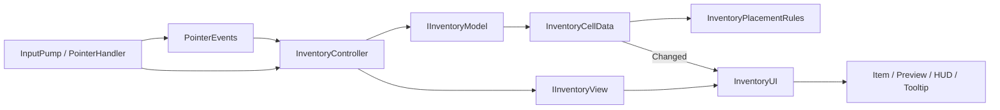

# Tactical Inventory

Escape from Tarkov의 격자형 인벤토리에서 영감을 받은 Unity 포트폴리오 프로젝트입니다. 크기가 다른 아이템을 배치하고 이동·회전하는 단일 기능에 집중했습니다.

## 실행

- Unity `6000.6.4f1`에서 `Assets/Scenes/Inventory.unity`를 열고 Play를 누릅니다.
- 로컬 Windows 빌드: `Build/TacticalInventory.exe`; 실행 파일과 `_Data` 폴더를 함께 유지합니다.
- 로컬 배포 묶음: `Builds/TacticalInventory-Windows.zip`을 풀고 실행합니다.
- 빌드 생성: Unity 메뉴 `Inventory > Build Windows Demo`.
- 시연: [60초 단계별 영상](docs/inventory-walkthrough.mp4).

## 조작

| 입력 | 동작 |
|---|---|
| 좌클릭 | 아이템 선택·정보 확인 |
| 드래그 | 잡은 칸을 기준으로 아이템 이동 |
| 드래그 중 R | 미리보기 회전 |
| Esc | 이동 취소 |
| Delete / REMOVE | 선택 아이템 삭제 |
| 마우스 휠 | 인벤토리 스크롤 |
| ADD ITEM | 다음 종류의 아이템을 빈 공간에 추가 |
| RESET DEMO | 초기 7개 아이템 복원 |

초록 영역은 배치 가능, 빨강 영역은 배치 불가입니다. 겹침·경계 초과·뷰포트 밖 드롭은 거절되며 원래 위치와 방향을 유지합니다.

## 구조

| 담당 | 코드 | 책임 |
|---|---|---|
| 조립 | `Inventory` | 의존성 연결과 수명 관리 |
| 배치 상태 | `InventoryCellData`, `InventoryEntry` | 아이템 위치·점유 상태 변경 |
| 배치 규칙 | `InventoryPlacementRules` | 경계·충돌·자기 점유 검증 |
| 정의·인스턴스 | `ItemDefinition`, `ItemCatalog`, `ItemData` | 공유 에셋과 개별 아이템 데이터 |
| 입력 수신 | `InventoryInputPump`, `InventoryItemPointerHandler` | 키보드·마우스 입력 전달 |
| 조작 | `InventoryController`, `InventoryDragSession` | 선택·드래그·확정·취소 상태 전환 |
| 표시 | `InventoryUI`와 `UI/`의 Presenter·View | 화면 갱신, 미리보기, 정보 표시 |
| 좌표 | `InventoryGridGeometry` | 화면 좌표와 격자 좌표 변환 |
| 데모 | `DemoInventoryFactory`, `DemoInventoryActions` | 초기 데이터와 추가·초기화 명령 |

## 설계

- 단일 책임 원칙(SRP): 입력 수신, 조작 상태, 배치 규칙, 모델 상태, 화면 표시, 화면 생성을 별도 타입으로 분리했습니다.
- 의존성 역전 원칙(DIP): 조작 로직은 `IInventoryModel`·`IInventoryView`, 데모 명령은 전용 인터페이스에 의존합니다.
- 인터페이스 분리 원칙(ISP): 데모 초기화·추가 명령과 일반 이동·삭제 계약을 분리했습니다.
- 개방 폐쇄 원칙(OCP): 아이템 종류는 코드 변경 없이 정의 에셋으로 추가하고, 입력·표시 구현은 인터페이스로 교체할 수 있습니다.
- 리스코프 치환 원칙(LSP): 테스트용 뷰가 같은 계약으로 동작하며 실제 UI 없이 조작 로직을 검증합니다.
- Factory: 아이템 뷰 생성과 데모 데이터 생성을 캡슐화했습니다.
- Observer: 모델 변경 이벤트와 포인터 이벤트로 입력·표시를 연결했습니다.
- 드래그 미리보기는 원본을 변경하지 않으며 검증된 드롭만 모델에 반영합니다.

## 검증

Unity Test Runner에서 `InventorySystem.Tests`(Edit Mode), `InventorySystem.PlayModeTests`(Play Mode)를 실행합니다.

[검증 결과](docs/validation.md) · [계획](PLAN.md) · [흐름 문서](docs/inventory-flow.html)

범위는 단일 인벤토리와 사각형 아이템입니다. 저장·불러오기, 스택, 가방 중첩, 다중 인벤토리는 후속 확장입니다.

## 시연 재생성

1. `InventorySceneBuilder`로 데모 씬을 재생성하려면 변경된 씬을 먼저 저장합니다.
2. Play 모드에서 `Inventory > Set Capture Resolution 1280x720`을 선택합니다.
3. `Inventory > Record Walkthrough (Play Mode)`로 1,800개 프레임을 캡처합니다. `TestResults/recording.txt`가 갱신되면 Play를 종료합니다.
4. 프로젝트 루트에서 `uv run --with imageio-ffmpeg python scripts/encode_walkthrough.py`를 실행합니다.

영상은 실행 중인 Game View를 30fps로 캡처한 60초 자동 조작 시연입니다. 흰 포인터, 클릭·홀드 링과 `CLICK`·`HOLD`·`R`·`ESC`·`DELETE` 표시로 입력 위치와 종류를 시각화합니다. 이동은 실제 아이템의 Unity 포인터 핸들러를 통해 처리합니다. 포인터는 시연용 오버레이이며 생성기는 에디터 전용입니다. 캡처 속도에 따라 생성에는 60초보다 오래 걸릴 수 있습니다.

## 에셋

- 무기·탄약 이미지: 기존 저장소의 `Assets/Resources/Sprites`; 원출처와 공개 배포 조건은 확인이 필요합니다.
- 폰트: 기존 TextMesh Pro의 Liberation Sans; 동봉된 `Assets/TextMesh Pro/Fonts` 라이선스를 유지합니다.
- 게임명은 구현의 참고 대상으로 사용했습니다.
